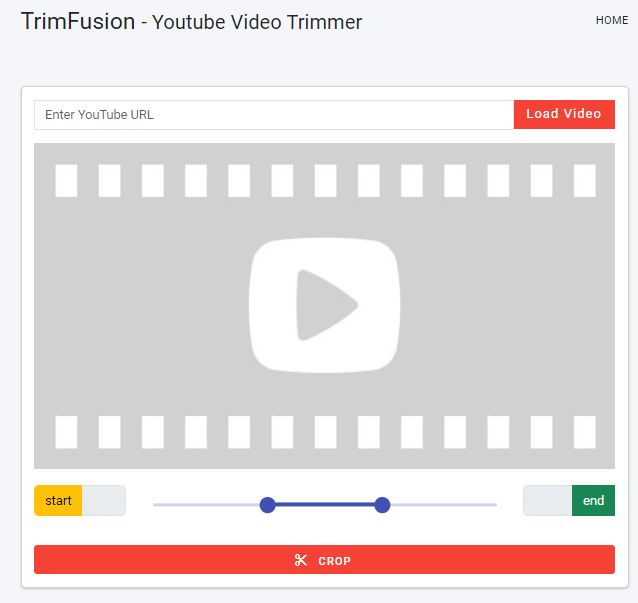
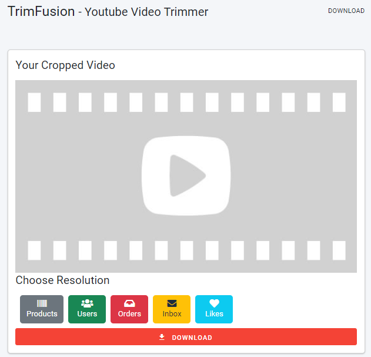

# TrimFusion

TrimFusion is a user-friendly web tool designed to enhance your video viewing experience. With the power to view YouTube videos directly within the interface, users can effortlessly cut and trim videos to their preferred lengths. Download the cropped videos in various formats and enjoy a sleek and intuitive design.

<!--    Include a screenshot of your app here -->

## Features
- **View YouTube Videos**: Embed and watch YouTube videos directly.
- **Cut and Trim**: Customize video lengths with easy-to-use cutting tools.
- **Download in Various Formats**: Save your customized videos in your preferred format.
- **Open Source**: Contribute and help improve TrimFusion.

## Installation
1. Clone the repository: `git clone https://github.com/Damika-Anupama/TrimFusion.git`
2. Navigate to the project directory: `cd TrimFusion`
3. Install dependencies: `npm install`
4. Start the development server: `ng serve`
5. Open in your browser: `http://localhost:4200`

## Design
Rendering Page

Download Page

## Usage
- Paste a YouTube link to view the video.
- Use the sliders or input fields to select the start and end times for cutting.
- Choose the desired download format and click the download button.

## Contributing
We welcome contributions from the community. 
<!-- Please read our [CONTRIBUTING.md](CONTRIBUTING.md) for guidelines on how to contribute. -->

## License
TrimFusion is licensed under the MIT License. See [LICENSE](./LICENSE) for more details.

## Contact
For any questions or feedback, please reach out to [gmail](damikaanupama@gmail.com).

---

Made with ❤️ by [Damika Anupama](https://www.linkedin.com/in/damika-anupama-62a22a19a/)
